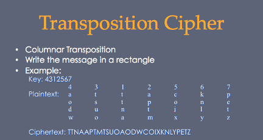
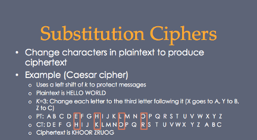
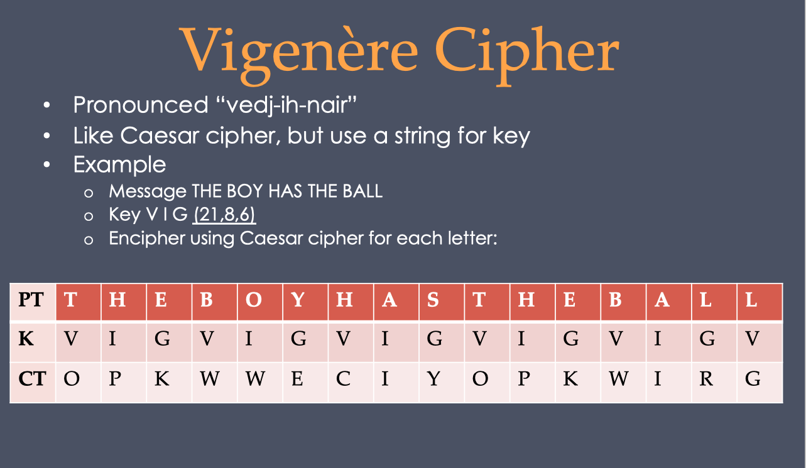
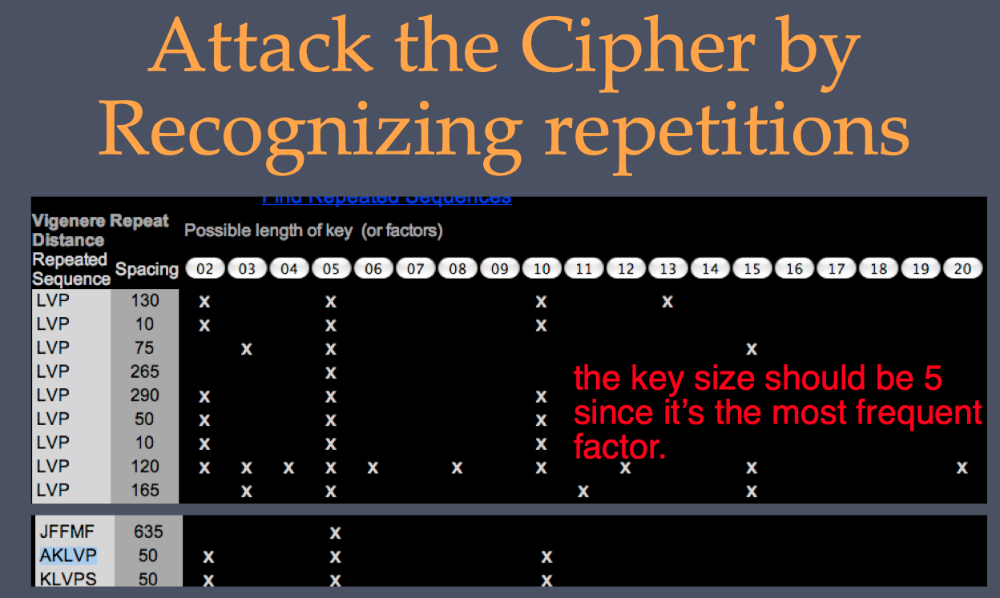

# Transposition-and-Substitiution-cipher

- cryptanalysis.py: Do analysis to cipher text: get number and frequency of each letter and compare it to English letter frequency
- arb_map.py: Do analysis and experiment to cipher text, get arbitrary mapping step by step.
- subs_encrypt.py: Do Caesar substitution to plaintext and do analysis.
- trans_encrypt.py: Do Columnar transposition to plaintext
- vigen_cipher.py: Do decryption and encryption by using Vigenere algorithm, Split Vigenere ciphertext to key_size lists, do anaylsis to each list and guess key. (Using https://www.simonsingh.net/The_Black_Chamber/vigenere_cracking_tool.html get key size)

## Transposition

## Substitution

## Vigenere cipher

crack vigenere cipher:
